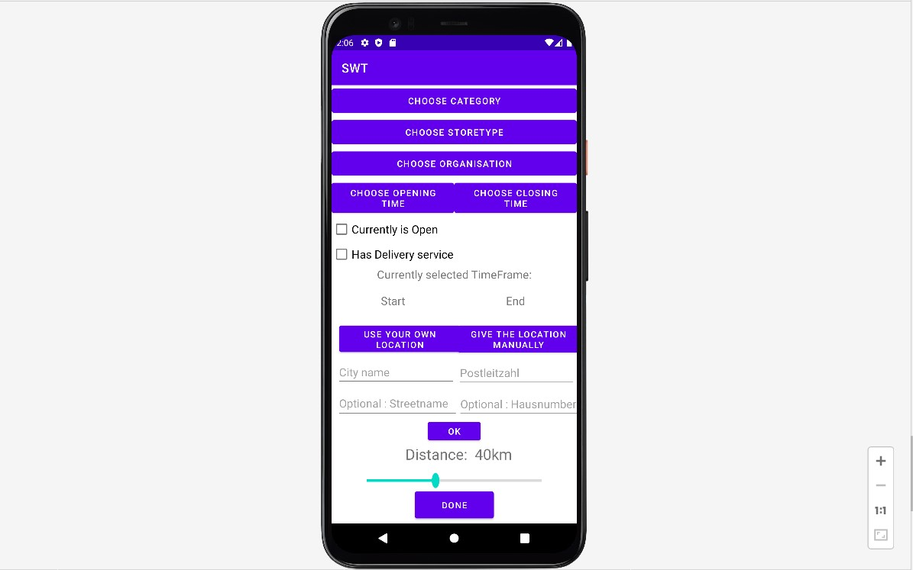

# RegionalApp-AndroidStudio

This  is a andriod based frontend application that is developed with andriod studio. The main function of the app is to search for stores in the region that the user wants to visit. This application was developed in the university  in 2021 in  "Softwarepraktikum" class.  

The app is well organized and  has many features.The features are:  
1- filter the information about the stores. For example: address, openinghours, owner etc... 
2- choose store type 
3- choose category 
4- choose organisation  
5- show near stores 
6- select opening and closing time 
7- filtering the stores by "currently opened" 
8- filtering the stores by "has delivery" 
9- select location(automatically or manual)  
10- choose range distnace 
11- favourite stores list
 
 
 
To run the app you need to install android studio and java on your PC

----------------------------------------------------------------------------------------------------
<h2>Screenshots are found in the Photos folder</h2>

